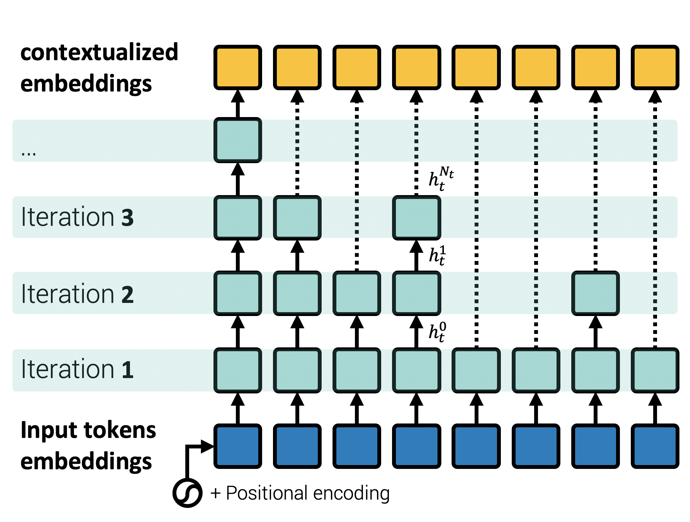
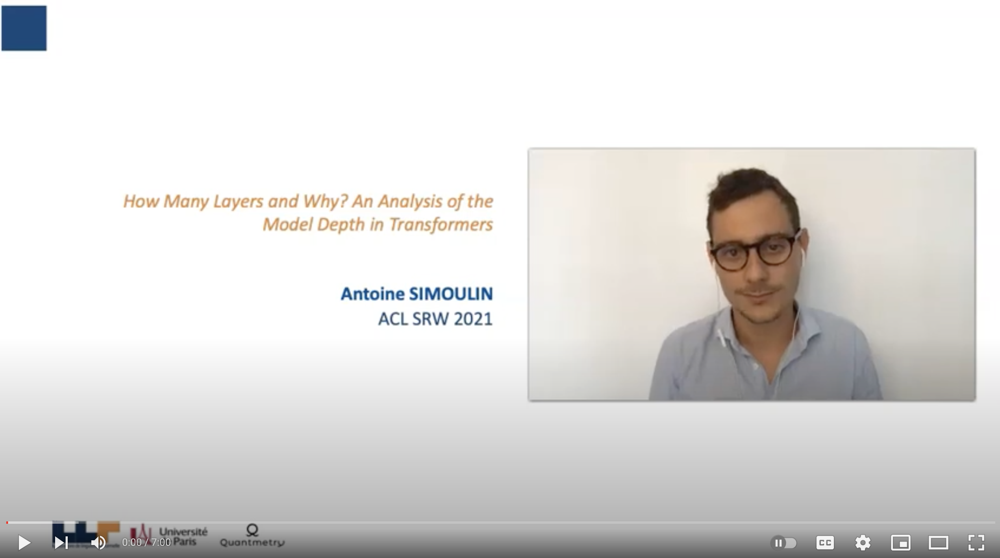

# Adaptive Depth Transformers

Implementation of the paper "How Many Layers and Why? An Analysis of the Model Depth in Transformers". In this study, we investigate the role of the multiple layers in deep transformer models. We design a variant of ALBERT that  dynamically adapts the number of layers for each token of the input.

## Model architecture

We augment a multi-layer transformer encoder with a halting mechanism, which allows dynamically adjusting the number of layers for each token.
We directly adapted this mechanism from Graves ([2016](#graves-2016)). At each iteration, we compute a probability for each token to stop updating its state.



## Pre-training

We pretrain three models, tiny, small, and base, whose hyper-parameters are detailed below.

| Models  | tiny | small | base |
| :------------- | ------------- | ------------- | ------------- |
| &tau;  | 1e-3 | 5e-4  | 2.5e-4  |
| Max iterations  | 6  | 12  | 24  |
| mlm (Acc.)  |  55.4  |57.1 | 57.4 |
| sop (Acc.)  |  80.9 | 83.9 | 84.3 |
| All tokens  |  3.8 | 7.1 | 10.0 |
| All unmasked tokens  | 3.5 | 6.5 | 9.2 |
| [MASK/MASK]  | 5.8 | 10.9 | 16.0 |
| [MASK/random] | 5.8 | 10.9 | 16.0 |
| [MASK/original] | 4.0 | 7.4 | 10.5 |
| [CLS] | 6.0 | 12.0 | 22.5 |
| [SEP] | 2.5 | 7.6 | 8.4 |

### How to use

We provide a set of demonstration notebooks to use the model:

| Notebook | Link |
|:---:|---|
| Pre-training ALBERT (ACT Penalty) | [](https://colab.research.google.com/github/AntoineSimoulin/adaptive-depth-transformers/blob/main/notebooks/Pre_training_ALBERT_(ACT_Penalty).ipynb) |
| Fine-tuning ALBERT (glue & hp search) | [](https://colab.research.google.com/github/AntoineSimoulin/adaptive-depth-transformers/blob/main/notebooks/Fine_tuning_ALBERT_(glue_&_hp_search).ipynb) |
​

## ACL (Student) 2021 Presentation

[](https://www.youtube.com/watch?v=wLho6ZIAwrM&ab_channel=AntoineSIMOULIN "ACL 2021 - How Many Layers and Why? An Analysis of the Model Depth in Transformers")

## Citations

### BibTeX entry and citation info

If you use our iterative transformer model for your scientific publication or your industrial applications, please cite the following [paper](https://aclanthology.org/2021.acl-srw.23/):

```bibtex
@inproceedings{simoulin-crabbe-2021-many,
    title = "How Many Layers and Why? {A}n Analysis of the Model Depth in Transformers",
    author = "Simoulin, Antoine  and
      Crabb{\'e}, Benoit",
    booktitle = "Proceedings of the 59th Annual Meeting of the Association for Computational Linguistics and the 11th International Joint Conference on Natural Language Processing: Student Research Workshop",
    month = aug,
    year = "2021",
    address = "Online",
    publisher = "Association for Computational Linguistics",
    url = "https://aclanthology.org/2021.acl-srw.23",
    doi = "10.18653/v1/2021.acl-srw.23",
    pages = "221--228",
}
```

### References

><div id="graves-2016">Alex Graves. 2016. Adaptive computation time for recurrent neural networks. CoRR, abs/1603.08983.</div>